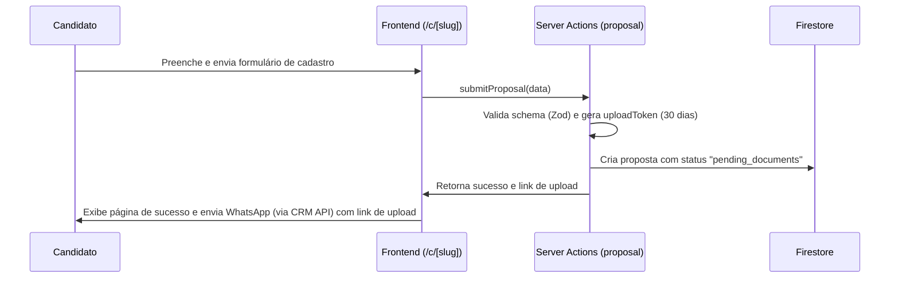
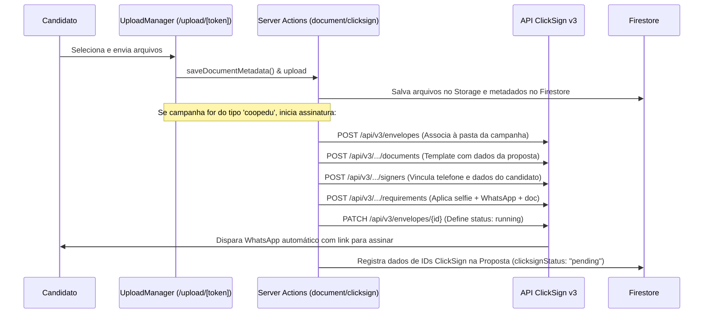
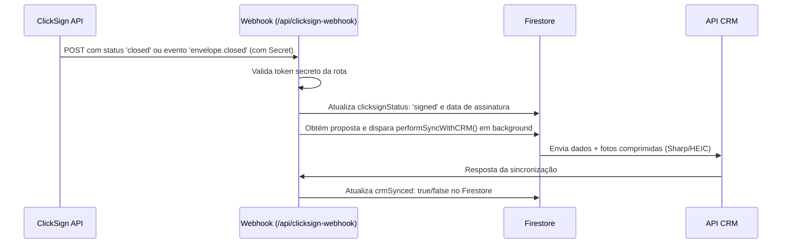
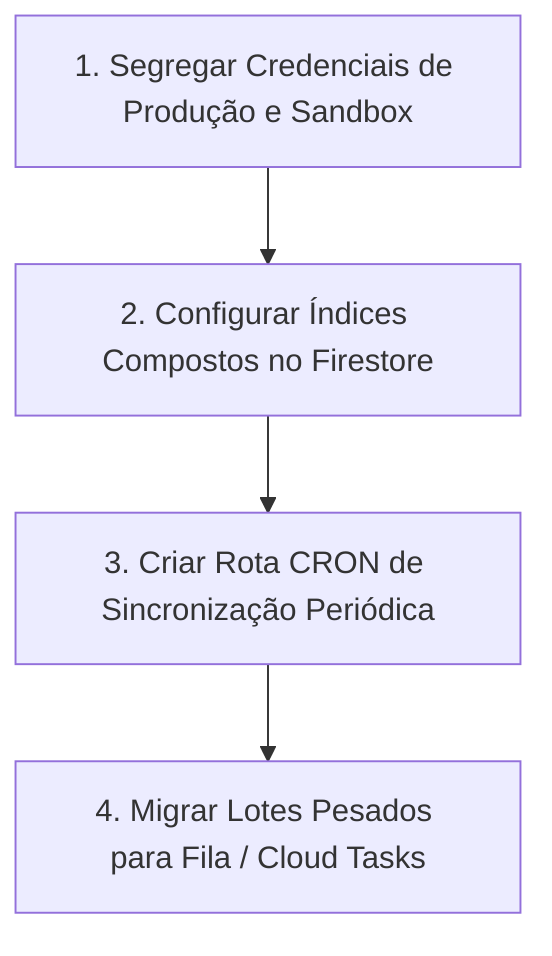

# HANDOFF - Cooperação Digital

Este documento serve como um guia completo de transição (Handoff) para a equipe de desenvolvimento sobre a plataforma **Cooperação Digital**. O sistema foi concebido para coletar cadastros de candidatos a cooperados, realizar a assinatura digital de termos de adesão e integrar as informações diretamente ao CRM da cooperativa.

---

## 1. Objetivo do Sistema

O objetivo principal da plataforma **Cooperação Digital** é automatizar o fluxo de associação digital de cooperados (para campanhas como as da **CoopEdu**). O sistema resolve as seguintes dores:
- Captura estruturada de dados demográficos de candidatos via formulários digitais customizados por campanha.
- Coleta de documentação comprobatória (Identidade, Comprovante de Residência, PIS, etc.).
- Assinatura eletrônica juridicamente válida de propostas de adesão através da API da **ClickSign** (utilizando autenticação por WhatsApp, Selfie e Documento Oficial).
- Envio instantâneo e automatizado das propostas concluídas para a API do CRM, com compressão inteligente de documentos para reduzir o consumo de banda e armazenamento.

---

## 2. Arquitetura Atual

A aplicação é construída sobre um ecossistema moderno baseado em **Next.js** e serviços serverless da **Firebase**.

### 2.1. Stack Tecnológica
- **Framework Principal**: Next.js 16 (App Router) com React 19 e TypeScript.
- **Estilização**: TailwindCSS v4 com PostCSS.
- **Banco de Dados & Storage**:
  - **Firebase Firestore**: Banco NoSQL para armazenar campanhas, propostas, logs de notificação e metadados de arquivos.
  - **Firebase Storage**: Repositório de arquivos para guardar os PDFs e imagens de comprovação enviados pelos candidatos.
- **Manipulação de Imagens**:
  - `sharp`: Processamento no servidor para redimensionar e comprimir imagens antes do envio ao CRM.
  - `heic-convert`: Decodificação de imagens HEIC/HEIF de dispositivos iOS para formatos compatíveis com web (JPEG).
- **Validação**: `zod` para declaração e validação de schemas em ambos os lados (cliente e servidor).

### 2.2. Estrutura de Pastas e Componentes
- `app/src/app/`: Roteamento e páginas da aplicação.
  - `/c/[slug]/page.tsx`: Página pública onde o candidato inicia a ficha cadastral a partir de uma campanha específica.
  - `/upload/[token]/page.tsx`: Portal público individualizado e seguro para upload de documentos complementares e acompanhamento da assinatura.
  - `/b/page.tsx`: Página inteligente de redirecionamento que força a abertura da aplicação em navegadores externos (Chrome/Safari), contornando limitações do WebView interno do WhatsApp.
  - `/admin/(authenticated)/`: Painel Administrativo.
    - `/campaigns/`: Criação e edição de campanhas digitais.
    - `/proposals/`: Central de listagem de propostas por campanha com busca por nome/CPF, paginação, exclusão e importação/exportação de CSV.
    - `/documents/`: Assistente visual em lote para importação de CSV com múltiplos CPFs, geração em massa de envelopes no ClickSign e reenvios.
  - `/api/clicksign-webhook/route.ts`: Endpoint HTTP para receber atualizações assíncronas de conclusão de envelopes via webhooks da ClickSign.
- `app/src/actions/`: Server Actions que encapsulam lógica de negócio e segurança.
  - [clicksign-actions.ts](file:///Users/jefersonrodrigues/Dev/Cooperação Digital/app/src/actions/clicksign-actions.ts): Integração ClickSign v3 (criação de envelopes por template, gerência de pastas por campanha, reenvios e conciliação de status em lote).
  - [proposal-actions.ts](file:///Users/jefersonrodrigues/Dev/Cooperação Digital/app/src/actions/proposal-actions.ts): CRUD de propostas, filtros, limpeza de CPFs duplicados e importação sequencial de CSV.
  - [document-actions.ts](file:///Users/jefersonrodrigues/Dev/Cooperação Digital/app/src/actions/document-actions.ts): Upload, gerenciamento de mídias, conversão/compressão Sharp e envio estruturado Multipart ao CRM.
  - [campaign-actions.ts](file:///Users/jefersonrodrigues/Dev/Cooperação Digital/app/src/actions/campaign-actions.ts): Gerenciamento de campanhas.
- `app/src/components/`:
  - `coopedu-form.tsx` e `coopera-form.tsx`: Formulários dinâmicos de cadastro baseados no tipo da campanha.
  - `upload-manager.tsx`: Interface reativa de upload de arquivos com validação de duplicados baseada em hash SHA-256 no client.

### 2.3. Modelo de Dados (Firestore Schemas)

#### Coleção: `campaigns`
```typescript
interface Campaign {
  id: string;
  name: string;              // Nome amigável da campanha
  slug: string;              // Segmento de URL (ex: coopedu-maracanau)
  active: boolean;           // Indica se a campanha está ativa
  formType: 'coopedu' | 'coopera'; // Modelo de formulário aplicado
  bannerUrl?: string;        // Banner personalizado
  clientId?: string;         // ID do contrato no CRM (ContractId)
  functionId?: string;       // Cargo/Função padrão associada
  professions: string[];     // Cargos disponíveis para seleção
  syncCRM: boolean;          // Habilita envio de propostas ao CRM
  clicksignFolderId?: string;// Pasta criada no ClickSign para agrupar documentos
  createdAt: string;
  updatedAt?: string;
}
```

#### Coleção: `proposals`
```typescript
interface Proposal {
  id: string;
  campaignId: string;
  nomeCompleto: string;
  cpf: string;
  email: string;
  telefone: string;
  status: 'pending_documents' | 'documents_received' | 'completed';
  uploadToken: string;       // UUID para link direto de upload (/upload/[token])
  uploadTokenExpires: string;// Data de expiração do token (30 dias)
  crmSynced?: boolean;       // Status de sincronização com o CRM
  crmSyncedAt?: string | null;
  // Integração ClickSign
  clicksignEnvelopeId?: string | null;
  clicksignDocumentId?: string | null;
  clicksignSignerId?: string | null;
  clicksignStatus?: 'pending' | 'signed' | null;
  clicksignSignedAt?: string | null;
  // Demais campos demográficos obtidos nos formulários
}
```
*Cada proposta contém as sub-coleções:*
- `documents`: Metadados dos arquivos enviados (`url`, `filename`, `type` [ex: identidade_frente], `size`, `hash`, `path`, `uploadedAt`).
- `notifications`: Histórico de mensagens enviadas via APIs integradas (`type`, `status`, `timestamp`, `error`, `payload`).

---

## 3. Regras de Negócio

1. **Customização por Tipo de Formulário (`formType`)**:
   - `coopedu`: Fluxo rígido. O candidato deve obrigatoriamente realizar a assinatura eletrônica do documento na ClickSign para que o envio de seus documentos possa ser finalizado e enviado ao CRM.
   - `coopera`: Fluxo simplificado. O candidato envia os dados diretamente, sem necessidade de assinatura digital de documentos via ClickSign.
2. **Validação de Exclusividade (CPF)**:
   - Um CPF só pode possuir uma proposta ativa por campanha. Durante cadastros públicos ou imports administrativos, o sistema alerta ou impede a criação de duplicidades.
3. **Assinatura Eletrônica Multi-Fator (ClickSign)**:
   - O envelope de assinatura criado exige três evidências integradas:
     - Token recebido via **WhatsApp** (disparado pela própria ClickSign).
     - Captura de **Selfie** com validação biométrica de imagem.
     - Foto do **Documento Oficial** de identificação.
4. **Organização em Pastas na ClickSign**:
   - Para evitar desorganização na ClickSign, ao inicializar assinaturas para uma nova campanha, o sistema cria uma pasta exclusiva (`/api/v3/folders`) e salva o ID retornado em `clicksignFolderId` no documento da campanha correspondente no Firestore. Todos os envelopes das propostas daquela campanha serão criados diretamente dentro dessa pasta.
5. **Limitação de Payload do CRM**:
   - O payload do CRM é enviado no formato Multipart e aceita arquivos de imagem ou PDF. Por limite da API do CRM, a requisição inteira não deve exceder **30MB**. O sistema valida o tamanho cumulativo e impede o envio de anexos não redimensionados de alta escala.
6. **Redução de Duplicidade de Arquivos**:
   - Ao carregar arquivos na página `/upload/[token]`, a aplicação calcula um hash SHA-256 no navegador do usuário. Se o hash coincidir com outro documento já anexado por aquele usuário, o sistema exibe um aviso de alerta indicando que o mesmo arquivo foi carregado repetidas vezes.

---

## 4. Fluxos Críticos

### Fluxo 1: Inscrição Pública e Geração de Token


### Fluxo 2: Upload de Documentos e ClickSign


### Fluxo 3: Recebimento de Webhooks da ClickSign


---

## 5. Decisões Arquiteturais Tomadas

- **WhatsApp Bypass (`/b`)**:
  Devido a limitações de sandboxing em navegadores móveis integrados (como o webview interno do WhatsApp rodando em iOS ou Android), operações de input de câmera para selfie ou upload de arquivos locais frequentemente falhavam. A criação da rota `/b?url=...` intercepta o acesso e redireciona de maneira nativa para o navegador padrão do dispositivo (Chrome ou Safari) usando protocolos específicos (`intent://` em Android).
- **Processamento e Redução de Imagens em Servidor (Sharp)**:
  Para evitar sobrecarregar o CRM com uploads de imagens de alta resolução tiradas por smartphones modernos, a aplicação implementou uma camada de Server Actions que baixa os arquivos do Firebase Storage temporariamente no Node.js, converte imagens do formato Apple HEIC/HEIF usando `heic-convert`, redimensiona para 1000px de largura máxima e comprime para JPEG de qualidade 60% via `sharp` antes de anexá-las à requisição HTTP final do CRM.
- **Isolamento de Credenciais via Firebase Admin**:
  Para garantir segurança rígida, nenhuma operação direta de escrita com credenciais de privilégio administrativo é efetuada no lado do cliente. Toda persistência no Storage e buscas relacionais complexas de CPF são executadas de maneira restrita via Server Actions utilizando o SDK `firebase-admin`, garantindo que o token e chaves privadas nunca cheguem ao navegador do cliente.
- **Normalização de Versões do ClickSign Webhook**:
  Como a ClickSign coexiste com esquemas legados e payloads v3, o parser do webhook `/api/clicksign-webhook` foi arquitetado para inspecionar de forma adaptativa o corpo da requisição, aceitando múltiplos formatos de payload (`data.attributes.name` v3 ou `event` legado).

---

## 6. Dívidas Técnicas

- **Processamento de Lote Síncrono e Timeouts Serverless**:
  Funções como `batchCreateClicksignEnvelopes`, `batchResendWhatsappByCampaign` e `batchSyncProposalsWithCRM` processam requisições de forma sequencial com pausas manuais (`setTimeout`). Em plataformas serverless como a Vercel, o limite máximo de tempo de execução de uma requisição HTTP é de 10 segundos (plano Hobby) ou 60 segundos (plano Pro). Processar lotes com mais de 10 a 20 propostas consecutivas no mesmo request pode estourar o timeout da rota de forma silenciosa.
- **Rate Limit na API da ClickSign**:
  A ClickSign impõe um limite máximo de requisições por minuto. A implementação atual tenta mitigar isso aplicando uma pausa forçada de 800ms por iteração no loop de lote, o que aumenta ainda mais o risco de timeout serverless mencionado acima.
- **Replicação de Código de Inicialização**:
  A Server Action `forceCreateClicksignEnvelope` e a lógica padrão em `getOrCreateProposalSignature` possuem trechos replicados de limpeza de campos do Firestore. O ideal é isolar a rotina de exclusão lógica de dados ClickSign em um helper único.
- **Acoplamento de Conexão Firebase**:
  Uso de dois arquivos de inicialização Firebase paralelos (`firebase.ts` para client sdk, `firebase-admin.ts` para admin sdk) que devem ser monitorados para evitar multiplas instâncias ativas concorrentemente em ambientes serverless frios (Cold Starts).

---

## 7. Bugs Conhecidos

- **Falha de Webhooks no Ambiente de Testes (Sandbox)**:
  A ClickSign não permite o disparo automático de Webhooks para endpoints locais (`localhost`) sem o uso de tuneladores externos expostos (como ngrok) devidamente cadastrados. Por causa disso, o status das assinaturas em testes locais não se atualiza automaticamente, exigindo a execução manual do botão "Sincronizar" no dashboard.
- **Secret do Webhook em Código/Env**:
  O código atual no webhook possui fallback e referências para uma chave secreta padrão fraca (`coop-wh-2024-secret`). Se o administrador esquecer de configurar o valor real de `CLICKSIGN_WEBHOOK_SECRET` em ambiente de produção, a integração continuará vulnerável a injeções de payloads falsos caso essa secret fraca seja descoberta.
- **Inexistência de Rollback Parcial no Upload em Lote**:
  Se o upload em lote de CSV falhar no meio das chamadas (por limite de taxa ou rede), a interface não fornece um estado de "Retomar do erro". O administrador é obrigado a rodar novamente todo o arquivo CSV, embora o sistema tente pular registros marcados como assinados.

---

## 8. Funcionalidades Concluídas

- **Estruturação de Campanhas**: Criação e edição de campanhas por slug no painel administrativo, contendo listas de profissões associadas e vinculação com o tipo de formulário (`coopedu` ou `coopera`).
- **Formulário Multi-Etapa**: UI dinâmica e de excelente performance para coleta de dados do candidato, com máscaras de CPF, CEP e telefones.
- **Gerenciador de Uploads**: Área de arraste-e-solte de arquivos na tela do candidato que realiza validação imediata de tipo de arquivo, limite de peso e alertas contra envio duplicado de fotos baseado em hash MD5/SHA-256 no client.
- **Integração ClickSign v3 Completa**: Geração automatizada de envelopes a partir do preenchimento de variáveis em template DOCX padrão.
- **Webhook Integrado**: Endpoint HTTP preparado para receber confirmação de assinatura e alterar de forma automática o status da proposta para assinado.
- **Ações em Massa por Campanha**:
  - Geração de assinaturas em lote por meio de carregamento de CSV de CPFs (`/admin/documents`).
  - Sincronização em lote das propostas de uma campanha inteira com o CRM de destino.
  - Reenvio em massa de alertas WhatsApp de assinaturas pendentes por campanha.
- **Filtros e Exportação de Resultados**: Painel administrativo permite filtrar propostas por status de envio, data ou nome, baixar PDFs originais/assinados, além de gerar relatórios consolidados em planilhas CSV.

---

## 9. Funcionalidades Pendentes

- **Automatização Completa do Sync de Envelopes (CRON)**:
  Substituir a necessidade do clique manual do botão de "Sincronizar" na listagem de documentos em lote por uma rotina CRON automatizada (como Vercel Cron Jobs) que consulte periodicamente todos os envelopes pendentes no ClickSign a cada hora.
- **Refatoração para Filas (Queue System)**:
  Migração das chamadas sequenciais pesadas de sincronização do CRM e de disparo de mensagens ClickSign em lote para uma fila de background gerenciada (ex: Inngest, Firebase Cloud Tasks ou QStash), evitando timeouts severos do Next.js Serverless.
- **Feedback Visual de Progresso de Lote**:
  Implementar progresso percentual reativo no frontend (lendo progresso parcial persistido no Firestore ou via streaming SSE) para substituir o spinner fixo que congela a tela durante o processamento em massa.

---

## 10. Convenções de Código

- **Diretivas do Next.js**:
  - Operações com banco de dados e APIs externas devem obrigatoriamente iniciar com `'use server'` e ser agrupadas em arquivos do diretório `src/actions/`.
  - Componentes de interface que controlam estados locais, animações Framer Motion ou eventos do DOM devem incluir `'use client'` no topo do arquivo.
- **Gerenciamento de Segredos**:
  - Chaves de API de terceiros (ClickSign, CRM X-API-KEY, Firebase Admin Private Key) devem obrigatoriamente ser consultadas a partir de variáveis de ambiente (`process.env`) e **nunca** expostas em constantes de escopo local ou repositório Git.
- **Padrões do TypeScript**:
  - Tipagem explícita para retornos de Server Actions e assinaturas de métodos integrados de forma a manter integridade e previsibilidade de bugs na interface.
- **Respeito aos Rate Limits**:
  - Toda chamada subsequente a APIs externas em estruturas de repetição (ex: loops `for`) deve conter um atraso assíncrono mínimo (usando Promises baseadas em `setTimeout`) variando de 500ms a 1000ms.

---

## 11. Próximos Passos Priorizados



1. **Segregação de Credenciais (Urgente)**:
   - Remover os fallbacks hardcoded de sandbox e garantir que o `.env.local` diferencie estritamente as URLs e tokens de produção (`CLICKSIGN_API_KEY`, `CLICKSIGN_API_URL`) nos respectivos servidores Vercel de teste e staging.
2. **Criação de Índices Compostos (Urgente)**:
   - Configurar no console do Firebase os índices compostos para as consultas de listagem do painel administrativo (ordenados por `createdAt` e filtrados por `campaignId` e `status`), prevenindo erros de carregamento na listagem de propostas do painel quando a base de dados crescer.
3. **Criação da Rota CRON (Média Prioridade)**:
   - Implementar a rota `/api/cron/sync` que busca e atualiza o status de todos os envelopes marcados como `pending` junto à ClickSign, automatizando o controle de conclusão da cooperativa.
4. **Fila de Background para Lotes (Alta Complexidade/Prioridade)**:
   - Refatorar a ação `batchSyncProposalsWithCRM` para usar Firebase Cloud Functions (com maior tempo de limite de timeout) ou uma fila de background, acabando com travamentos de tela de administradores na importação de listas com mais de 30 CPFs.
